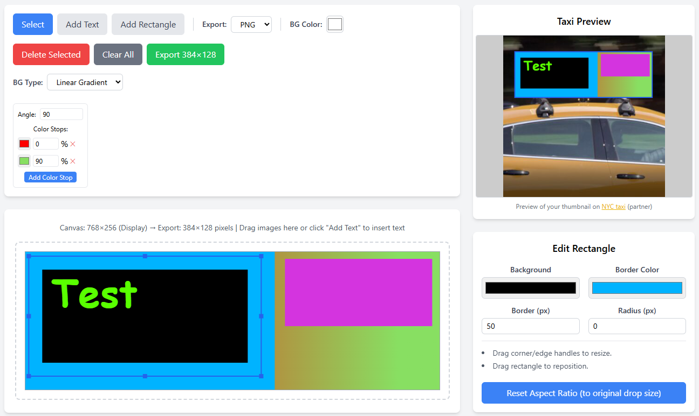

# Taxi Ad Editor

A web-based tool for creating and customizing advertisements designed for taxi-top digital displays.

## Features

The Taxi Ad Editor allows you to:

*   **Create Rich Content:** Add text elements and rectangles to your ad canvas.
*   **Visuals:** Add images to the canvas and scale them with SHIFT to keep their aspect-ratio.
*   **Customize Appearance:**
    *   Set background types: Solid colors or linear/radial gradients.
    *   Adjust border thickness and radius for rectangle elements.
    *   Choose colors for backgrounds, borders, and text.
*   **Manage Elements:** Select, delete individual elements, or clear the entire canvas.
*   **Export:** Export your final ad design, in PNG or JPG format with specific dimensions (e.g., 384x128 pixels) and PPI.
*   **Live Preview:** See a preview of how your ad will look on a taxi.
*   **Object Manipulation:** Drag corners/edges of elements to resize and drag elements to reposition them.
*   **Aspect Ratio Control:** Reset elements to their original aspect ratio.

## Demo

